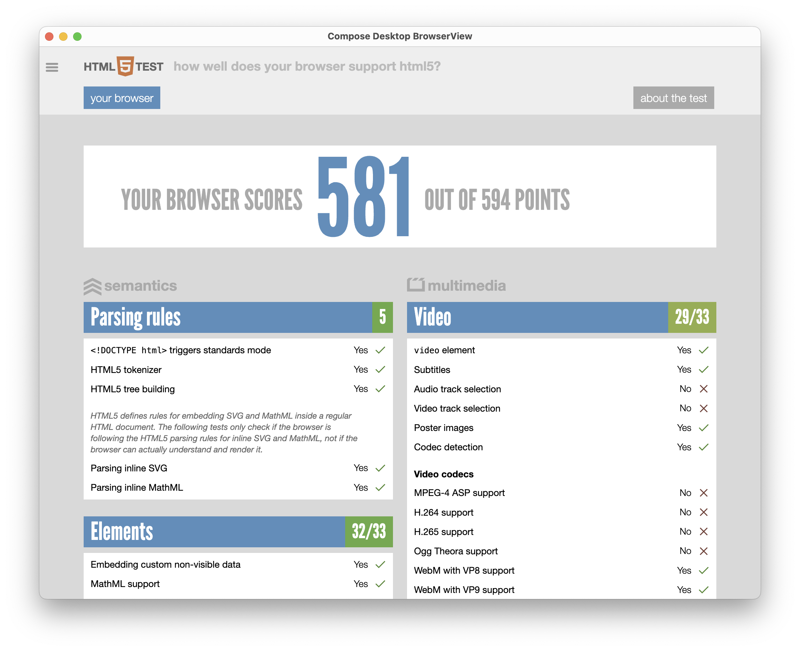

# JxBrowser in Compose Gradle Project

This example demonstrates how to configure a Gradle project with JxBrowser to embed a Compose `BrowserView` widget into a Compose Desktop application to display web pages.

## Download the Project

Clone this repository using the following command:

 ```bash
 git clone https://github.com/TeamDev-IP/JxBrowser-QuickStart
 cd JxBrowser-QuickStart/Gradle/Compose
 ```

## Get License

Download a free 30-day evaluation license key by sending a request via the [web form](https://www.teamdev.com/jxbrowser#evaluate).

## Run the application

Use the following command:

```bash
./gradlew run -Djxbrowser.license.key=<your_license_key>
```

It will build and start a Swing desktop application with Compose `BrowserView` inside that displays https://html5test.teamdev.com as shown below:


